# NeuraForge

**High-Performance C++ Neural Inference Engine**

## 📖 About

**NeuraForge** is a production-ready, high-performance neural inference engine built from the ground up with modern C++20. It eliminates PyTorch runtime dependencies while delivering faster inference through carefully crafted optimizations including SIMD operations, memory pooling, and asynchronous processing.

## 🚀 Quick Start

### 🐳 Option 1: Docker (Recommended)

```bash
# 1. Start inference server
docker run -p 8080:8080 -v $(pwd)/models:/models neuraforge:latest

# 2. Test Inference API
curl -X POST http://localhost:8080/infer \
  -H "Content-Type: application/json" \
  -d '{"model": "resnet50.pt", "input": "image.jpg"}'
```

### 🔧 Option 2: Development Setup

```bash
# 1. Clone repository
git clone https://github.com/your-org/neuraforge.git
cd neuraforge

# 2. Setup development environment
./scripts/setup-dev.sh

# 3. Build and test
source .env.local
./scripts/build.sh --preset=release --tests
./scripts/test.sh
```

## 🔧 API Reference

### Basic Usage

```cpp
#include <neuraforge/neuraforge.hpp>

// Load and run inference
auto engine = neuraforge::InferenceEngine::create("model.pt");
auto input = torch::randn({1, 3, 224, 224});
auto result = engine.infer(input);
```

### Async Processing

```cpp
// Asynchronous inference with coroutines
auto process_batch() -> neuraforge::task<void> {
    auto engine = neuraforge::InferenceEngine::create("model.pt");
    auto inputs = load_batch("images/", 32);

    for (const auto& input : inputs) {
        auto result = co_await engine.infer_async(input);
        process_result(result);
    }
}
```

### Pipeline Processing

```bash
// Create processing pipeline
auto pipeline = neuraforge::Pipeline()
    .add_transform<Resize>({224, 224})
    .add_transform<Normalize>({0.485, 0.456, 0.406})
    .add_model("efficientnet.pt")
    .add_postprocess<TopK>(5);

auto result = pipeline.process("image.jpg");
```

## 🏗️ Architecture

```mermaid
graph TB
    subgraph "🔥 NeuraForge Core"
        A[📁 Model Files] --> B[🔄 ModelLoader]
        B --> C[⚡ InferenceEngine]
        C --> D[🧮 TensorProcessor]
        C --> E[🎯 ExecutionContext]
    end

    subgraph "🚀 Performance Layer"
        D --> F[🔧 SIMD Operations]
        E --> G[🧵 Thread Pool]
        D --> H[💾 Memory Pool]
        E --> I[⚡ Cache Manager]
    end

    subgraph "🌐 API Layer"
        C --> J[🔌 REST API]
        C --> K[📡 gRPC Service]
        C --> L[🐍 Python Bindings]
    end

    style C fill:#ff6b6b,color:#fff
    style F fill:#4ecdc4,color:#fff
    style G fill:#45b7d1,color:#fff
```

<div align="center">



</div>
